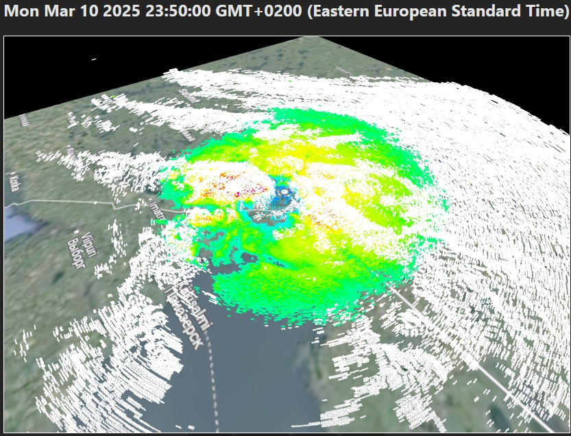

<h1 align="center"> View Finnish Meteorological Institute radar data in 3D. (Very early prototype)</h1>

  

---

<h3> Current functionality: </h3>
<ul>
  <li>fetches radar data on 10.3.2025 (snow storm, kesälahti radar)</li>
  <li>fetched data types: etop: 20 and ppi: 3.0° (supports multiple pointclouds and types with buffers)</li>
  <li>buttons for going next(-1h, supports buffering.) previous(+1h) {0-24hours from the set date}</li>
  <li>buttons for pointcould stats(console.log()) and zero for going back to set date starting time</li>
</ul>

---

<a href="https://en.ilmatieteenlaitos.fi/radar-data-on-aws-s3"> ilmatieteenlaitos.fi/radar-data-on-aws-s3 </a>

TODO: too many things to list for now and the project is halted while im doing projects requested by other people which will actually see some use and provide some value.
